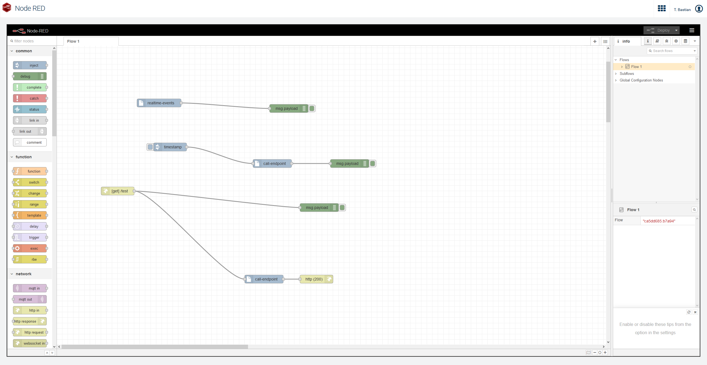

# Cumulocity - Node-RED

This repository contains the required parts to run Node-RED within a Cumulocity tenant.

The repository is splitted into two parts ([backend](backend/README.md) and [frontend](frontend/README.md)).
The backend folder contains all the required bits to run Node-RED as a microservice within Cumulocity.
The frontend folder contains an optional [Cumulocity WebSDK](https://cumulocity.com/guides/web/angular/) based angular app, which has been created to serve the Node-RED frontend (hosted in the microservice) within an iframe.

## Login
With version 10.7.0.4 of the Cumulocity backend we are no longer able to use an OAuth session to access the Node-RED microservice. The Basic Auth login strategy has to be used to access Node-RED. You can still configure your tenant with the OAuth login strategy, just make sure that you are not selecting "Enforce OAuth Internal" if you want to use Node-RED. The Node-RED frontend will log your existing OAuth session out and will open a prompt for credentials to start a new Basic Auth session. Note that in case you have other windows/tabs opened for that specific tenant/domain, you are propably also going to be logged out within those windows. 
In case you are then opening a new session within another window to one of the other cumulocity apps and login via OAuth this could cause some issues within the still open Node-RED tab (requests to Node-RED not succeeding).

If you are still using Basic Auth as login strategy, you shouldn't have any issues here.
## TODOs
- Currently the microservice uses the `PER_TENANT` isolation level. In future I might want to think about solutions to let this microservice run with `MULTI_TENANT` isolation level, so a single microservice instance can be used by multiple tenants to save costs.
- Create more nodes for simpler integration of Cumulocity.
- ~~Look for solution to handle the basic auth popup when the application is opened initially. This does not happen on tenants which use the CookieAuth strategy (OAuth).~~ As of Cumulocity version 10.7.0.4 we are no longer capable to use OAuth for logging in. You can still choose OAuth as the login strategy, but make sure to not set the "Enforce OAuth Internal" option if you would like to use Node-RED.
- ~~Better handling on encrypting credentials that have been used within Node-RED flows.~~ Credentials are now stored within an encrypted tenant option.